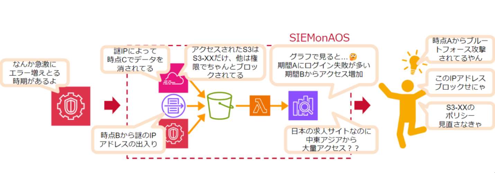
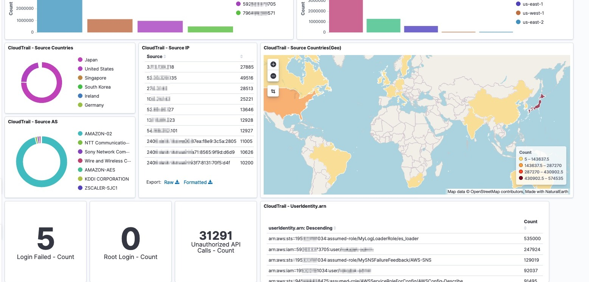
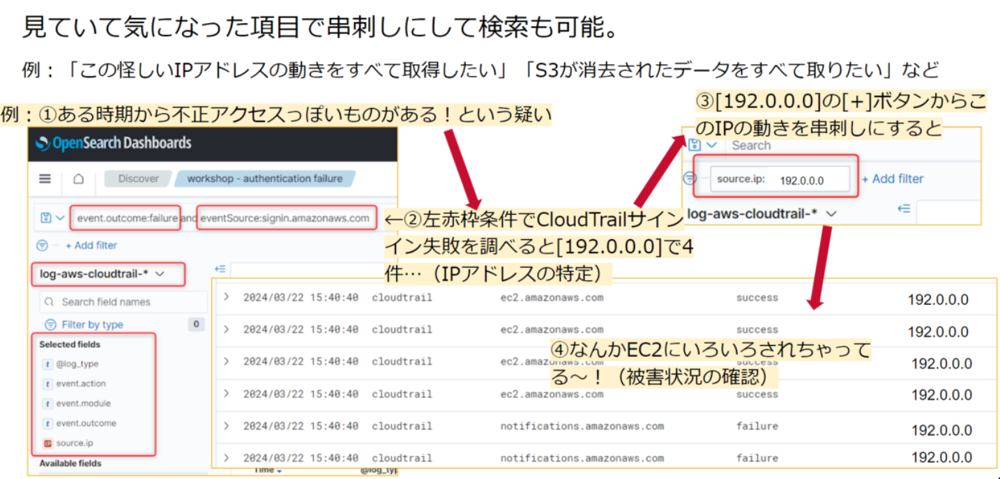

# SIEM on Amazon OpenSearch Service を使って簡単にログ分析基盤を作ろう

垣見@kakimi

## はじめに
垣見です。

「漠然とCloudTrailやGuardDutyなどのログを採っているが活用できていない」  
「ログ分析基盤構築の手間を減らしたい」  
「セキュリティインシデントの対策をしたい」

そんなお困りごとを解決してくれるのがSIEM on Amazon OpenSearch Serviceです。

自分が初めて業務で検証したということもあり、思い入れのあるこちらのセキュリティソリューションをご紹介します。

## 前提： 「SIEM」とは
Security Information and Event Management の略で、AWS 用語というよりはセキュリティ界隈の一般用語だそうです。「しーむ」と読みます。

Amazon Web Services ブログ （https://aws.amazon.com/jp/blogs/news/siem-on-amazon-elasticsearch-service/） では、「セキュリティ機器、ネットワーク機器、その他のあらゆる機器のデータを収集及び一元管理をして、相関分析によって脅威検出とインシデントレスポンスをサポートするためのソリューション」と表現しています。

簡単に、「セキュリティインシデントに備え、色々なデータを集めて一元的に管理・分析するためのシステム」とざっくり捉えると良いかと思います。

## SIEM on Amazon OpenSearch Service とは
SIEM on Amazon OpenSearch Service は、Amazon OpenSearch Service を使ってAWS上で構築されたSIEMです。

AWSマルチアカウント環境下でのセキュリティインシデントを調査することができるAWS公式ソリューションで、AWS CloudFormation または AWS Cloud Development Kit (AWS CDK) を使って30分程度でデプロイできます。

AWS CloudTrail、Amazon GuardDuty、Amazon VPC Flow Logs などのログを Amazon S3 のバケットに収集することで ETL 処理が動き、OpenSearch上で時系列でログを見たり、特定のキーワードを検索したり、自分の気になる項目をまとめたダッシュボードを作成したりできるようになります。

複数ログを簡単にまとめられるので、ここのロギングデータを見るよりも容易に何が起きているかを調べることが出来るのが強みです。

## SIEM のなにがうれしいのか

### トラブルシューティングをこれ1つで直感的にできる

このサービスでは1つの画面で異なるサービスのログをまとめて確認可能だという部分が大きなポイントです。  
特徴的なのはフィールド名の統一（正規化）が行われていることです。

例えば同じ「送信元アドレス」を表すフィールドは、本来 VPC Flow Logs では「srcaddr」、CloudTrailでは「sourceIPAddress」という用に分かれています。
これを SIEM では「source.ip」に自動統一しているため、表の同じ列を見るだけでどこからの通信かを比べて見たり、あるIPアドレスの動きを串刺しして見たりすることができます。

また、OpenSearch の独自クエリとGUI操作でのログのフィルタリングを行うこともできます。
フィルター基準はあらかじめ用意されているフィールド名から選ぶ形で、GUI形式で簡単にフィルタリング操作もできます。

クエリ例：`eventName:ConsoleLogin and responseElements.ConsoleLogin:Failure`

また、アラートでトラブルシューティングにあたっての「検知」「監視」をある程度自動化することもできます。

### ログ集約のための導入が簡単

AWS CloudFormation または AWS Cloud Development Kit (AWS CDK) を使って30分程度でデプロイできてしまうのはやっぱりうれしいですね。

対象の Amazon S3 バケットにログを収集すれば残りのETL処理はLambdaが勝手に行ってくれるので、本来開発に時間がかかるデータの正規化処理や通知系の仕組みが簡単に実装できます。

以下は対応している項目の一部抜粋です。（対応していないものは頑張って実装する必要はあります。）

* Amazon GuardDuty
* AWS WAF
* AWS CloudTrail
* Amazon Route 53 Resolver
* Elastic Load Balancing
* Linux OS（/var/log/messages, /var/log/secure）
* Windows Server（System event log, Security event log）

### 可視化ダッシュボードの作成が簡単

Amazon OpenSearch を使っており、取り込んだデータを図示・表化することも簡単です。  
基本的なVisualizeセットは用意されており、Excelのグラフ作成のような操作感で可視化を行うことができます。

例えば、「ある一定時期にはどんなCloudTrailイベントが多かったかを知りたい」という需要が出たら、簡単にグラフを作成し、それをまとめてダッシュボードも作ることができます。

また MaxMind 社の GeoIP機能（IPアドレスの国別マッピング機能）を使うことで、世界地図上に表されるヒートマップにより異常アクセスを視認可能です。
IPだけではすぐに分からない場所の把握がスムーズにでき、お客様の「国内向けWebサービスに対する日本国外からの異常アクセス（DDoS攻撃など）を確認できるようにしたい」といった需要に答えてくれる部分です。

## まとめ

異常が無いか、組織にあったダッシュボードを定期的に確認することでセキュリティ意識を高め、何か異常があったときにはトラブルシューティングをリソース横串で行う、という風にして組織のセキュリティをどんどん向上させていけるソリューションだと思います。

導入・撤廃も簡単なので、本格的な SaaS サービスを入れる代わりにスモールスタートとして行うような形も良いのではないでしょうか？  
また、すでに AWS のセキュリティサービスは有効化しているがなかなか活用できていない・内容がよくわからないという環境の方にとっては、示唆を得やすい可視化ができるのもメリットかと思います。

ぜひぜひ、SIEM on Amazon OpenSearch Service 触ってみてください！

#### 出典

SIEM on Amazon OpenSearch Service 

https://github.com/aws-samples/siem-on-amazon-opensearch-service/blob/main/README_ja.md

#### 著者紹介

---

    
    

        

            <b>垣見</b>
            <a href="https://github.com/Tamakiiiiichi">GitHub@Tamakiiiiichi</a>
        

    

かきみです。とあるAWSパートナー企業のエンジニアとして、ご提案や課題解決のお手伝いをしています。 
最近はOrganizations環境のセキュリティや統制などに関わることが多いです。 
図解多めの技術ブログをよく書きます。いつかどこかで皆さんのお役に立てれば幸いです。

